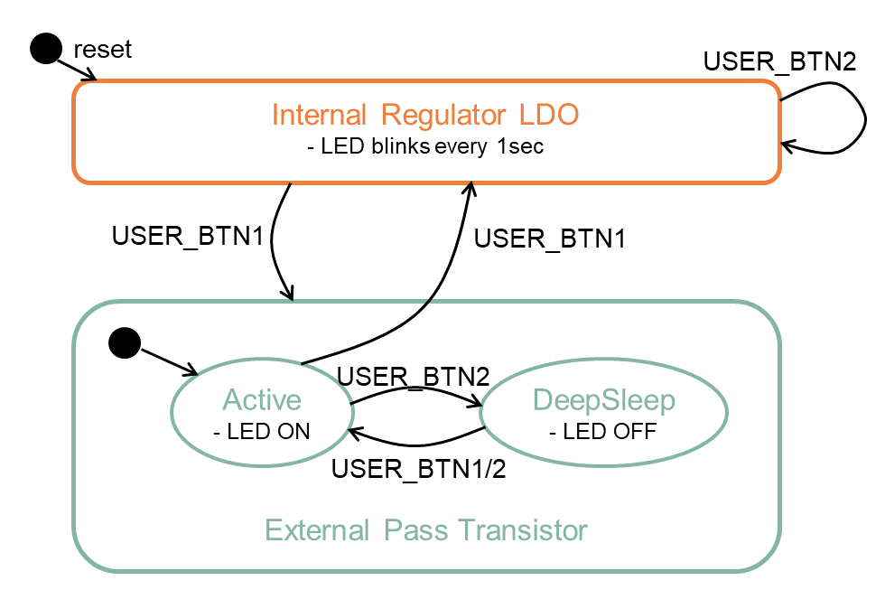
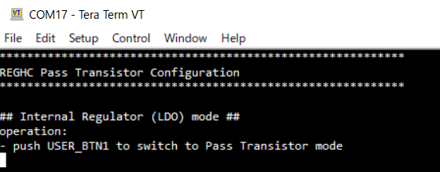
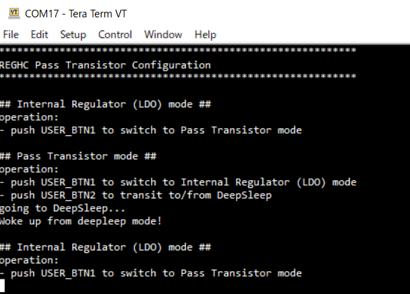

# REGHC Pass Transistor Configuration

**This code example demonstrates how to switch and configure to an external Pass Transistor.**

## Device

The device used in this code example (CE) is:

- [TRAVEO™ T2G CYT4BF Series](https://www.infineon.com/cms/en/product/microcontroller/32-bit-traveo-t2g-arm-cortex-microcontroller/32-bit-traveo-t2g-arm-cortex-for-body/traveo-t2g-cyt4bf-series/)

## Board

The board used for testing is:

- TRAVEO™ T2G evaluation kit ([KIT_T2G-B-H_LITE](https://www.infineon.com/cms/en/product/evaluation-boards/kit_t2g-b-h_lite/))

## Scope of work

This code example demonstrates how to switch the power supply source between an internal regulator (LDO) and an external pass transistor. It also shows enter and wake up from DeepSleep mode when the external pass transistor is used.

## Introduction  

**High Current Regulator Controller (REGHC)**  
The TRAVEO™ T2G device have two built-in regulators (Active Regulator, DeepSleep Regulator).
In addition, it also has the High Current Regulator Controller (REGHC) which is used to control the external power system by Pass Transistor.
The following are the features of the TRAVEO™ T2G power supply system:

- VDDD power supply voltage range of 2.7 V to 5.5 V.
- Core supply at VCCD.
- Multiple on-chip regulators:
  - Active Regulator to power the MCU in Active or Sleep mode in case of low current consumption.
  - DeepSleep Regulator to power peripherals in DeepSleep mode.
- REGHC, which supports higher load current in Active and Sleep power modes using a pass transistor.

More details can be found in [Technical Reference Manual (TRM)](https://www.infineon.com/dgdl/?fileId=5546d4627600a6bc017600bfae720007), [Registers TRM](https://www.infineon.com/dgdl/?fileId=5546d4627600a6bc017600be2aef0004) and [Data Sheet](https://www.infineon.com/dgdl/?fileId=5546d46275b79adb0175dc8387f93228).

## Hardware setup

This CE has been developed for:

- TRAVEO™ T2G Body High Lite evaluation kit ([KIT_T2G-B-H_LITE](https://www.infineon.com/cms/en/product/evaluation-boards/kit_t2g-b-h_lite/)) 
 
No changes are required from the board's default settings.

## Implementation

This code example shows how to switch the power supply source between the internal regulator (LDO) and external pass transistor. It also shows the enter and wake up from DeepSleep Mode when external pass transistor is used.
After executing the example code, the MCU is operating with the internal regulator (LDO) by default, and can be switched between the internal regulator and the external pass transistor by pressing USER_BTN1. It also can enter and wake up from DeepSleep Mode by pressing USER_BTN2 when pass transistor is used. 
 

**Pass Transistor initialization**

Initialization of the Pass Transistor is done once with the function *configureRegulator()*. This function configures the High Current Regulator Controller (REGHC) for the MCU. The setting parameters are defined in structure *CONFIGURE_REGULATOR_ARG1* and *CONFIGURE_REGULATOR_ARG2*, they are passed to *Cy_Srom_CallApi_2()* as argument to call a SROM API **ConfigureRegulator** (Opcode = 0x15) via Inter Processor Communication (IPC).

**Switch between LDO and Pass Transistor**

Switch between LDO and the Pass Transistor by call the function *switchOverRegulators()*. This function should be called after *configureRegulator()* executed. The setting parameters are defined in structure *SWITCH_REGULATOR_ARG_TARGET_EXT* or *SWITCH_REGULATOR_ARG_TARGET_INT*, they are passed to *Cy_Srom_CallApi()* as argument to call a SROM API **SwitchOverRegulators** (Opcode = 0x11) via IPC.

**Enter DeepSleep Mode**

<a href="https://infineon.github.io/mtb-pdl-cat1/pdl_api_reference_manual/html/group__group__syspm__functions__power.html#ga5150c28fe4d2626720c1fbf74b3111ca"><i>Cy_SysPm_CpuEnterDeepSleep()</i></a> sets executing CPU to the DeepSleep mode. And sets wake up actions as by interrupt with argument <a href="https://infineon.github.io/mtb-pdl-cat1/pdl_api_reference_manual/html/group__group__syspm__data__enumerates.html#gaae6a9f528630a2d69bb70b3bced1f0ac"><i>CY_SYSPM_WAIT_FOR_INTERRUPT</i></a>.

## Run and Test

After code compilation, perform the following steps to flashing the device:

1. Connect the board to your PC using the provided USB cable through the KitProg3 USB connector.
2. Open a terminal program and select the KitProg3 COM port. Set the serial port parameters to 8N1 and 115200 baud.
3. Program the board using one of the following:
   - Select the CE project in the Project Explorer.
   - In the **Quick Panel**, scroll down, and click **[Project Name] Program (KitProg3_MiniProg4)**.
4. After programming, the CE starts automatically. Confirm that the messages are displayed on the UART terminal.
    - *Terminal and pin output on program startup* 
    - *Terminal and pin output on program execution* 
5. You can debug the example to step through the code. In the IDE, use the **[Project Name] Debug (KitProg3_MiniProg4)** configuration in the **Quick Panel**. For details, see the "Program and debug" section in the [Eclipse IDE for ModusToolbox™ software user guide](https://www.infineon.com/dgdl/?fileId=8ac78c8c8386267f0183a8d7043b58ee). Note that the DeepSleep function does not operate in debug mode, so do not use debug mode if you want to check the operation of DeepSleep.

**Note:** **(Only while debugging)** On the CM7 CPU, some code in `main()` may execute before the debugger halts at the beginning of `main()`. This means that some code executes twice: once before the debugger stops execution, and again after the debugger resets the program counter to the beginning of `main()`. See [KBA231071](https://community.infineon.com/t5/Knowledge-Base-Articles/PSoC-6-MCU-Code-in-main-executes-before-the-debugger-halts-at-the-first-line-of/ta-p/253856) to learn about this and for the workaround.

## References

Relevant Application notes are:

- AN235305 - GETTING STARTED WITH TRAVEO™ T2G FAMILY MCUS IN MODUSTOOLBOX™
- [AN226698](https://www.infineon.com/dgdl/?fileId=8ac78c8c7cdc391c017d0d3a98b3675e) - External power supply design guide for TRAVEO™ T2G family

ModusToolbox™ is available online:

- <https://www.infineon.com/modustoolbox>

Associated TRAVEO™ T2G MCUs can be found on:

- <https://www.infineon.com/cms/en/product/microcontroller/32-bit-traveo-t2g-arm-cortex-microcontroller/>

More code examples can be found on the GIT repository:

- [TRAVEO™ T2G Code examples](https://github.com/orgs/Infineon/repositories?q=mtb-t2g-&type=all&language=&sort=)

For additional trainings, visit our webpage:  

- [TRAVEO™ T2G trainings](https://www.infineon.com/cms/en/product/microcontroller/32-bit-traveo-t2g-arm-cortex-microcontroller/32-bit-traveo-t2g-arm-cortex-for-body/traveo-t2g-cyt4bf-series/#!trainings)

For questions and support, use the TRAVEO™ T2G Forum:  

- <https://community.infineon.com/t5/TRAVEO-T2G/bd-p/TraveoII>  